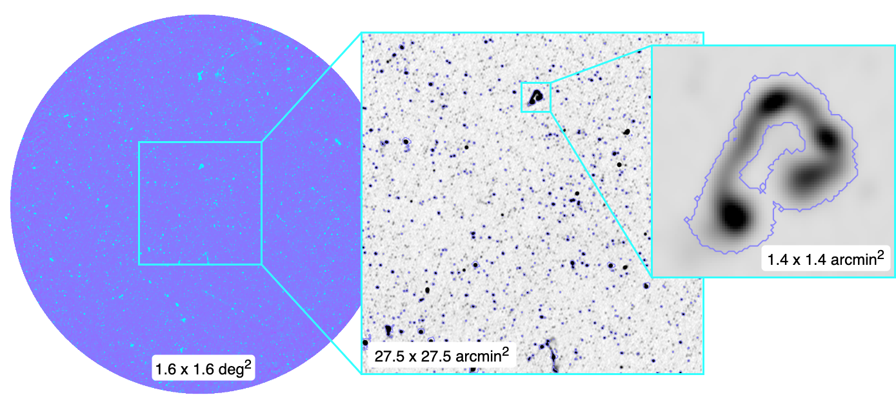

.. ContinUNet documentation master file, created by
   sphinx-quickstart on Tue Nov  4 15:48:32 2025.
   You can adapt this file completely to your liking, but it should at least
   contain the root `toctree` directive.

ContinUNet Documentation
========================

ContinUNet is a source finding package for radio continuum survey data powered by U-Net segmentation algorithm. 
Radio continuum image example from the MIGHTEE survey Early Science data [2] COSMOS field, with overplotted segmentation boundaries of sources detected by ContinUNet.

.. toctree::
   :maxdepth: 2
   :caption: Contents

   installation
   quickstart
   api

.. [1] Heywood, I. et al. *MIGHTEE: total intensity radio continuum imaging and the COSMOS / XMM-LSS Early Science fields*, 2021.
